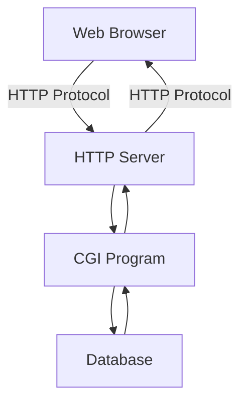

HTTP协议（HyperText Transfer Protocol，超文本传输协议）

HTTP是一个基于TCP/IP通信协议来传递数据（HTML 文件, 图片文件, 查询结果等）。

HTTP协议通信流程：

## http请求方法

| 方法 | description |
| ------- | --------------------------------------------------------- |
| GET     | 请求指定的页面信息，并返回实体主体。                         |
| HEAD    | 类似于get请求，只不过返回的响应中没有具体的内容，用于获取报头 |
| POST    | 向指定资源提交数据进行处理请求（例如提交表单或者上传文件）。数据被包含在请求体中。POST请求可能会导致新的资源的建立和/或已有资源的修改。 |
| PUT     | 从客户端向服务器传送的数据取代指定的文档的内容。             |
| DELETE  | 请求服务器删除指定的页面。                                  |
| CONNECT | HTTP/1.1协议中预留给能够将连接改为管道方式的代理服务器。     |
| OPTIONS | 允许客户端查看服务器的性能。                                |
| TRACE   | 回显服务器收到的请求，主要用于测试或诊断。                   |
## http状态码

### 消息 1XX

### 成功 2XX

| stateCode | Code                          | description                                                  |
| --------- | ----------------------------- | ------------------------------------------------------------ |
| 200       | OK                            | 请求已成功，请求所希望的响应头或数据体将随此响应返回         |
| 201       | Created                       | 请求已经被实现，而且有一个新的资源已经依据请求的需要而建立，且其 URI 已经随Location 头信息返回。 |
| 202       | Accepted                      | 服务器已接受请求，但尚未处理。                               |
| 203       | Non-Authoritative Information | 服务器已成功处理了请求，但返回的实体头部元信息不是在原始服务器上有效的确定集合，而是来自本地或者第三方的拷贝。 |
| 204       | No Content                    | 服务器成功处理了请求，但不需要返回任何实体内容，并且希望返回更新了的元信息。 |
| 205       | Reset Content                 | 服务器成功处理了请求，且没有返回任何内容。但是与204响应不同，返回此状态码的响应要求请求者重置文档视图。该响应主要是被用于接受用户输入后，立即重置表单，以便用户能够轻松地开始另一次输入。 |

### 重定向 3XX

### 请求错误 4XX

| stateCode | Code           | decsription               |
| ----- | --------------- | -------------------------- |
| 400   | Bad Request     | 请求参数有误 |
| 401   | Unauthorized    | 当前请求需要用户验证，没有权限 |
| 402 | Payment Required | 该状态码是为了将来可能的需求而预留的 |
| 403   | Forbidden       | 服务器已经理解请求，但是拒绝执行它 |
| 404   | Not Found       | 请求所希望得到的资源未被在服务器上发现 |
| 408   | Request Timeout | 请求超时 |

### 服务器错误 5XX

| stateCode | Code         | decsription             |
| ----- | --------------- | -------------------------- |
| 500   | Internal Server Error | 服务器端的源代码出现错误 |
| 502 | Bad Gateway | 作为网关或者代理工作的服务器尝试执行请求时，从上游服务器接收到无效的响应 |
| 504 | Gateway Timeout | 作为网关或者代理工作的服务器尝试执行请求时，未能及时从上游服务器（URI标识出的服务器，例如HTTP、FTP、LDAP）或者辅助服务器（例如DNS）收到响应 |

