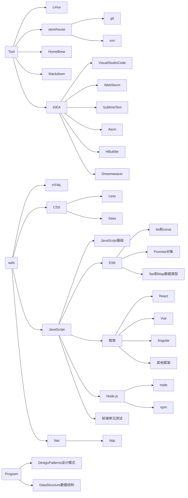

# "Hello, World!"

> “种一棵树最好的时间是十年前，其次是现在”————《dead aid》非洲经济学家Dambisa Moyo

### 目录


<details>
  <summary>展开查看</summary>
  <pre>
    <code>
    - Web Language
    - HTML
      - ...
    - CSS
      - ...
    - SVG
      - ...
    - JavaScript
      - Javascript基础
        - Javascript基础
        - JavaScript原理
        - Array对象
        - Data对象
        - error对象
        - ...
      - ES6
        - Set数据结构
        - ...
      - Family
        - ReactFamily
          - React
          - Router
          - Redux
          - Ant Design
          - ...
        - VueFamily
          - ...
        - Component
          - jQuery
          - d3
          - eCharts
      - TypeScript
      - NodeJs
        - node
        - npm
  - Net
    - HTTP
    - ...
  - Tool
    - git
    - svn
    - webpack
    - mackdown/
    - Linux
    - subelime
    - Homebrew
    - ...
  - 
  - Program
    - DataStructure
      - ...
    - DesignPatterns
      - ...
  - ...
    </code>
  </pre>
</details>


### 结构树状图



`任何事情坚持下去，都会有意想不到的收获`

```
                ii.                                         ;9ABH,
               SA391,                                    .r9GG35&G
               &#ii13Gh;                               i3X31i;:,rB1
               iMs,:,i5895,                         .5G91:,:;:s1:8A
                33::::,,;5G5,                     ,58Si,,:::,sHX;iH1
                 Sr.,:;rs13BBX35hh11511h5Shhh5S3GAXS:.,,::,,1AG3i,GG
                 .G51S511sr;;iiiishS8G89Shsrrsh59S;.,,,,,..5A85Si,h8
                :SB9s:,............................,,,.,,,SASh53h,1G.
             .r18S;..,,,,,,,,,,,,,,,,,,,,,,,,,,,,,....,,.1H315199,rX,
           ;S89s,..,,,,,,,,,,,,,,,,,,,,,,,....,,.......,,,;r1ShS8,;Xi
         i55s:.........,,,,,,,,,,,,,,,,.,,,......,.....,,....r9&5.:X1
        59;.....,.     .,,,,,,,,,,,...        .............,..:1;.:&s
       s8,..;53S5S3s.   .,,,,,,,.,..      i15S5h1:.........,,,..,,:99
       93.:39s:rSGB@A;  ..,,,,.....    .SG3hhh9G&BGi..,,,,,,,,,,,,.,83
       G5.G8  9#@@@@@X. .,,,,,,.....  iA9,.S&B###@@Mr...,,,,,,,,..,.;Xh
       Gs.X8 S@@@@@@@B:..,,,,,,,,,,. rA1 ,A@@@@@@@@@H:........,,,,,,.iX:
      ;9. ,8A#@@@@@@#5,.,,,,,,,,,... 9A. 8@@@@@@@@@@M;    ....,,,,,,,,S8
      X3    iS8XAHH8s.,,,,,,,,,,...,..58hH@@@@@@@@@Hs       ...,,,,,,,:Gs
     r8,        ,,,...,,,,,,,,,,.....  ,h8XABMMHX3r.          .,,,,,,,.rX:
    :9, .    .:,..,:;;;::,.,,,,,..          .,,.               ..,,,,,,.59
   .Si      ,:.i8HBMMMMMB&5,....                    .            .,,,,,.sMr
   SS       :: h@@@@@@@@@@#; .                     ...  .         ..,,,,iM5
   91  .    ;:.,1&@@@@@@MXs.                            .          .,,:,:&S
   hS ....  .:;,,,i3MMS1;..,..... .  .     ...                     ..,:,.99
   ,8; ..... .,:,..,8Ms:;,,,...                                     .,::.83
    s&: ....  .sS553B@@HX3s;,.    .,;13h.                            .:::&1
     SXr  .  ...;s3G99XA&X88Shss11155hi.                             ,;:h&,
      iH8:  . ..   ,;iiii;,::,,,,,.                                 .;irHA
       ,8X5;   .     .......                                       ,;iihS8Gi
          1831,                                                 .,;irrrrrs&@
            ;5A8r.                                            .:;iiiiirrss1H
              :X@H3s.......                                .,:;iii;iiiiirsrh
               r#h:;,...,,.. .,,:;;;;;:::,...              .:;;;;;;iiiirrss1
              ,M8 ..,....,.....,,::::::,,...         .     .,;;;iiiiiirss11h
              8B;.,,,,,,,.,.....          .           ..   .:;;;;iirrsss111h
             i@5,:::,,,,,,,,.... .                   . .:::;;;;;irrrss111111
             9Bi,:,,,,......                        ..r91;;;;;iirrsss1ss1111
```

## 笔记规范

### 命名

####文件夹名

1. 尽量使用英文命名
2. 

#### 文件名

1. 使用标题名称
2. 使用帕斯卡命名法

#### 文件内

1. 使用驼峰命名法

| 名称           | 符号         |
| -------------- | ------------ |
| 文件名         | `<fileName>` |
| 模块包、依赖包 | `<moduleName>`、`<packageName>` |


### 格式

#### 文件内

##### 标题类

1. 主标题使用一级标题
2. 小标题使用引用
3. Example使用引用

##### 名词类

1. 使用``包裹属性名称、方法名称、

##### 代码

##### 终端

1. 命令前使用 `$`
2. 注释前使用`#`


`In short, the years are long, but it's worth waiting for.`

