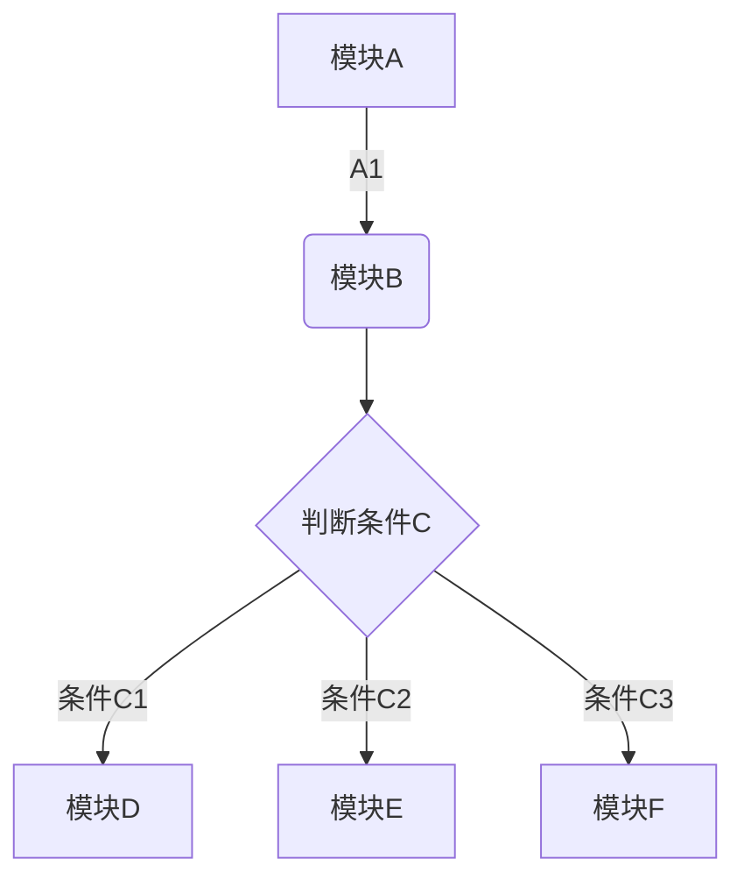
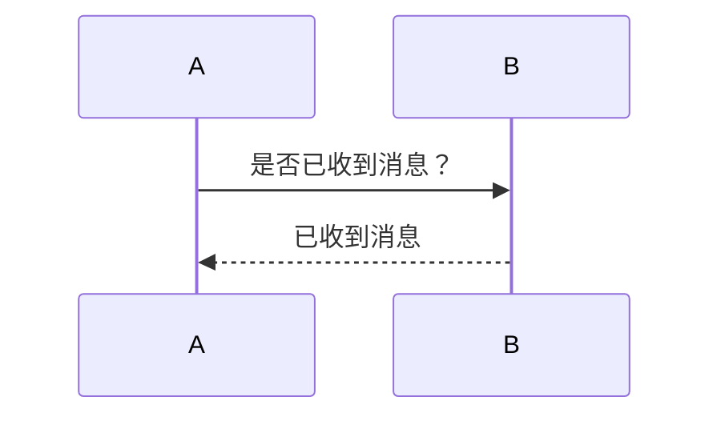
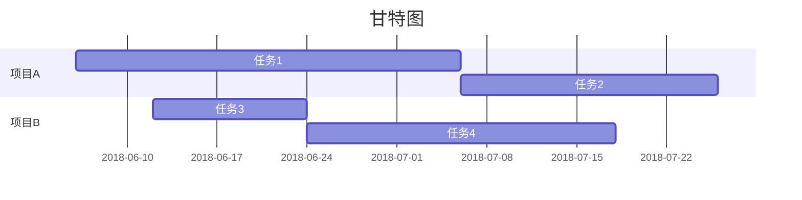

# Mackdown
[TOC]
## 标题

# 一级标题
## 二级标题
### 三级标题
#### 四级标题
##### 五级标题
###### 六级标题

> 语法
```
# 一级标题
## 二级标题
### 三级标题
#### 四级标题
##### 五级标题
###### 六级标题
```
#和标题之间用空格分隔开

## 字体

**加粗**
*斜体*
***斜体加粗***
～～删除线～～

> 语法
```
**加粗**
*斜体*
***斜体加粗***
～～删除线～～
```

## 引用
> 引用
>> 引用

> 语法
```
> 引用
>> 引用
```

## 分割线
——————
————————
***
*****

> 语法
```
——————
————————
***
*****
```

## 列表
### 无序列表
- 列表内容
    - 列表内容
        - 列表内容
+ 列表内容
    + 列表内容
        + 列表内容
* 列表内容
    * 列表内容
        * 列表内容

> 语法
```
- 列表内容
    - 列表内容
        - 列表内容
+ 列表内容
    + 列表内容
        + 列表内容
* 列表内容
    * 列表内容
        * 列表内容
```

### 有序列表
1. 列表内容
    1. 列表内容
    2. 列表内容
2. 列表内容

> 语法
```
1. 列表内容
    1. 列表内容
    2. 列表内容
2. 列表内容
```

### 列表嵌套
上一级和下一级之间敲三个空格即可

## 表格
表  头|表  头|表  头
:----|:---:|-----:
内容|内容|内容|

> 语法
```
表  头|表  头|表  头
:-----|:---:|-----:
内容|内容|内容|
```
第二行分割表头和内容。
-有一个就行，为了对齐，多加了几个
文字默认居左
-两边加:表示文字居中
-右边加:表示文字居右
注：原生的语法两边都要用 | 包起来


## 代码
### 单行代码
`function() {}`

> 语法
```
`function() {}`
```

### 代码块
```
function(){}
```

> 语法
```
    ```
        function() {
            alert('hellow, world');
        }
    ```
```

## 其他
### 任务
* [ ] 任务
* [x] 已完成

> 语法
```
* [] 任务
* [x] 已完成
```

### 超链接
[百度一下](https://www.baidu.com)

> 语法
```
[百度一下](https://www.baidu.com)
```

### 设置目录
[TOC]

> 语法
```
[TOC]
```
设置之后可以自动根据设置的分级标题来自动生成目录

### 图片
@w=300h=150
```
@w=宽度h=高度
```

### 图表
#### 饼状图&折线图&柱状图&条形图
```chart
,预算,收入,花费,债务
June,5000,8000,4000,6000
July,3000,1000,4000,3000
Aug,5000,7000,6000,3000
Sep,7000,2000,3000,1000
Oct,6000,5000,4000,2000
Nov,4000,3000,5000,

type: pie
title: 每月收益
x.title: Amount
y.title: Month
y.suffix: $
```

> 语法
```
    ```chart
    ,预算,收入,花费,债务
    June,5000,8000,4000,6000
    July,3000,1000,4000,3000
    Aug,5000,7000,6000,3000
    Sep,7000,2000,3000,1000
    Oct,6000,5000,4000,2000
    Nov,4000,3000,5000,

    type: pie
    title: 每月收益
    x.title: Amount
    y.title: Month
    y.suffix: $
    ```
```
##### type:
饼状图：pie
折线图：line
柱状图：column
条形图：bar

#### 流程图


> 语法
```
    ```mermaid
    graph TD
    A[模块A] -->|A1| B(模块B)
    B --> C{判断条件C}
    C -->|条件C1| D[模块D]
    C -->|条件C2| E[模块E]
    C -->|条件C3| F[模块F]
    ```
```

#### 时序图


> 语法
```
    ```mermaid
    sequenceDiagram
    A->>B: 是否已收到消息？
    B-->>A: 已收到消息
    ```
```

#### 甘特图


> 语法
```
    ```mermaid
    gantt
    title 甘特图
    dateFormat  YYYY-MM-DD
    section 项目A
    任务1           :a1, 2018-06-06, 30d
    任务2     :after a1  , 20d
    section 项目B
    任务3      :2018-06-12  , 12d
    任务4      : 24d
    ```
```

