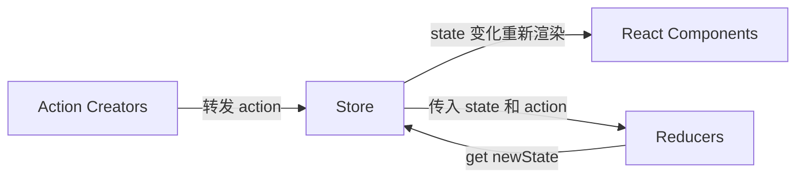

# this

## 绑定方式

- 默认绑定

  ```js
  var name = 'a';
  
  function show() {
    var name = 'name';
    console.log(this.name);
  }
  
  show(); // a
  ```

  > `this` 绑定在全局对象上

- 隐式绑定

  ```js
  function show() {
    var name = 'a';
    console.log(this.name);
  }
  
  var name = 'b';
  
  var obj = {
    name: 'c',
    showName: show,
  }
  
  obj.showName(); // c
  ```

  > `this` 指向调用的 `obj` 对象上

- 显示绑定

  ```js
  var obj = {
    name: 'a',
  }
  
  var name = 'b';
  
  function show() {
    var name = 'c';
    console.log(this.name);
  }
  
  show.call(obj); // a
  ```

  > 通过 `call`、`apply`、`bind`显示地改变调用的this对象

- `new` 绑定/构造函数调用

  ```js
  function createObj(name) {
  	this.name = name;
  }
  
  var obj = new createObj('a');
  
  console.log(obj.name); // a
  ```

  > 通过构造函数或者 `new` 操作符创建的对象，`this` 会绑定到创建的实例上

## 改变 `this`

```js
var name = 'a';
var obj = {
  name: 'b',
};

function showName(arg1, arg2) {
  var name = 'c';
  console.log(name, arg1, arg2);
}

showName('name1', 'name2'); // a name1 name2
showName.call(obj, 'name1', 'name2'); // b name1 name2
showName.apply(obj, ['name1', 'name2']); // b name1 name2
showNmme.bind(obj, 'name1', 'name2')(); // b name1 name2
```


**绑定的优先级为 `new` > 显示绑定  > 隐式绑定 > 默认绑定**

> 普通函数的 `this` 谁调用指向谁，它是运行期间绑定的，和它声明的环境无关，只和调用它的对象有关

> 箭头函数没有 `this` 绑定，谁创建方法指向谁

# 箭头函数

1. 箭头函数不能用于构造函数

2. 箭头函数没有 `prototype` 属性

3. 箭头函数不能绑定 `arguments`

4. 箭头函数不能绑定 `this`，其内部的this绑定到它的外围作用域，所以也不能使用 `call` 或 `apply` 来改变其运行的作用域

   ```js
   window.name = "window";
   
   let name = "name";
   let obj = {
       name: "obj",
       getName: () => {
           return this.name;//this指向window
       }
   };
   
   obj.getName(); // window
   ```

# 变量提升


# 原型链 && 闭包

> 利用原型让一个引用类型继承另一个引用类型的属性和方法

## 原型

### 继承方式

> OO语言支持两种继承方式：接口继承和实现继承

#### 接口继承

只继承方法签名

#### 实现继承

继承实际的方法，**`ECMAScript` 只支持实现继承，而且其实现集成主要是依靠原型链来实现的**

```js
function SuperType() {
  this.property = true;
}

SuperType.prototype.getSuperValue = function() {
  return this.property;
};

function SubType() {
  this.subproperty = false;
}

// 继承了SuperType
SubType.prototype = new SuperType();

SubType.prototype.getSubValue = function() {
  return this.subproperty;
};

var instance = new Subtype();
alert(instance.getSuperValue()); // true;
```

**`prototype` 和 `__proto__` 的区别**

`prototype` 是每个**函数**才有的属性

`__proto__` 是每个**对象**都有的属性

# 同步异步


# 事件机制


# `DOM` 事件


# 防抖和节流

防抖是延迟执行，如果再触发则重新延迟

节流是一个时间内只执行一次


# 中间件


# `Redux` 原理

## 为什么要用 `Redux`

`react` 中数据是单向数据流，为了解决两个非父子组件之间的通信

## `Redux` 设计理念

`Redux` 是将整个应用状态存储到一个地方上称为 `store` ,里面保存着一个状态树 `store tree` ,组件可以派发 `dispatch` 行为 `action` 给 `store`,而不是直接通知其他组件，组件内部通过订阅 `store` 中的状态 `state` 来刷新自己的视图。

> `Redux`工作流



## `Redux` 三大原则

1. 唯一数据源

   ​	整个应用的 `state` 都被存储到一个状态树里面，并且这个状态树，只存在于唯一的 `store` 中

2. 保持只读状态

   ​	`state` 是只读的，唯一改变 `state` 的方法就是触发 ·action，`action` 是一个用于描述以发生时间的普通对象

3. 数据改变只能通过纯函数来执行

   ​	使用纯函数来执行修改，为了描述 `action` 如何改变 `state` 的，你需要编写 `reducers`

## `Redux`概念解析

### `Store`

- `store` 就是保存数据的地方，你可以把它看成一个数据，整个应用智能有一个 `store`

- `Redux` 提供 `createStore` 这个函数，用来生成 `Store`

  ```js
  import { createStore } from 'redux';
  
  const store = createStore(fn);
  ```

### `State`


# `Vdom` 原理及`diff`算法

只对比同级

# `HTTPS` 安全性


# `HTTP` 状态码


# `rem`


# `getComputedStyle`


# 面向对象和面向过程

面向对象只关注结果，面向过程关注如何做

## 面向对象的三大特性

1. 封装
   1. 隐藏对象的属性和实现细节，仅对外提供公共访问方式，将变化隔离，便于使用，提高复用性和安全性。
2. 继承
   1. 提高代码复用性；继承是多态的前提。
3. 多态
   1. 父类或接口定义的引用变量可以指向子类或具体实现类的实例对象。提高了程序的拓展性。

## 五大基本原则（单开里依接）

1. 单一职责原则
   1. 类的功能要单一
2. 开放封闭原则
   1. 一个模块对于拓展是开放的，对于修改是封闭的
3. 里式替换原则
   1. 子类可以替换父类出现在父类能够出现的任何地方
4. 依赖倒置原则
   1. 高层次的模块不应该依赖于低层次的模块，他们都应该依赖于抽象。抽象不应该依赖于具体实现，具体实现应该依赖于抽象。
5. 接口分离原则
   1. 设计时采用多个与特定客户类有关的接口比采用一个通用的接口要好。


# 前端性能优化

- 雪碧图
- 减少http重复请求，合理设置 HTTP缓存
- 资源合并压缩（webpack打包工具）
- CSS Sprites
- 将外部脚本置底（将脚本内容在页面信息内容加载后再加载）
-  异步执行 inline脚本
- css选择器
- 试用CDN


- 减少不必要的 HTTP跳转
- 减少dom操作，（重绘和回流）
- 减少作用域链查找和闭包

## 浏览器的缓存机制

- Cookie

  - IE6或更低版本最多20个cookie
  - IE7和之后的版本最后可以有50个cookie。
  - Firefox最多50个cookie
  - chrome和Safari没有做硬性限制

  > 优点

  > 缺点

  - 数量和长度有限制，20条，4kb，超过的会被裁掉
  - 安全性问题。如果cookie被人拦截了，那人就可以取得所有的session信息。即使加密也与事无补，因为拦截者并不需要知道cookie的意义，他只要原样转发cookie就可以达到目的了。
  - 自己域名的Cookie 父级域名以及其他域名是不可访问

- 浏览器本地缓存（HTML5）

  -  localStorage 
    - 没有时间限制的数据存储
    - 不会过期
    - 数据可跨越多个窗口，无视当前会话，被共同访问、使用
  - sessionStorage
    - 浏览器关闭则丢失
    - 每个窗口的数据都是独立的
    - 在同一窗口的同一网站的任何界面都可以访问

  > localStorage和sessionStorage有共同的api

  ```js
  localStorage.length //获得storage中的个数
  localStorage .key(n) //获得storage中第n个键值对的键
  localStorage.key = //value
  localStorage.setItem(key, value) //添加
  localStorage.getItem(key) //获取
  localStorage.removeItem(key) //移除
  localStorage.clear() //清除
  ```

  - globalStorage
    - 浏览器关闭后仍有
    - 域中任何一个页面存储的信息都能被所有的页面共享
    - 目前只有FF支持
    - 只支持当前域下的globalStorage存储
  - Web Sql Database（目前只谷歌浏览器支持）
    - openDatabase：这个方法使用现有数据库或创建新数据库创建数据库对象。
    - ransaction：这个方法允许我们根据情况控制事务提交或回滚。
    - executeSql：这个方法用于执行真实的SQL查询。

# ***规范***

大标题使用一级标题 `#`

细分往下使用标题 `# * n`

特殊情况使用斜体 `**`

注释使用 `>`

代码示例使用代码块，并在代码块注明代码语言类型

```language
…
```

文字内的变量、操作符等使用``