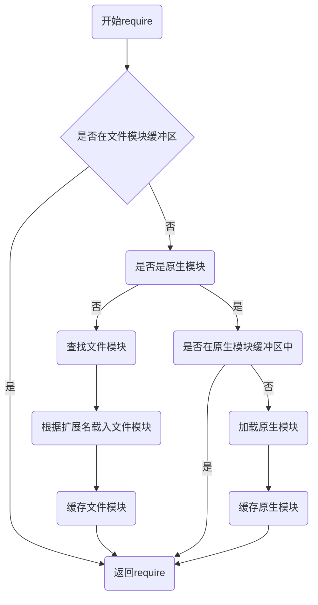

module加载优先级

```mermaid
graph TB

A(开始require) --> B{是否在文件模块缓冲区}
B --> |是|Z(返回require)
B --> |否|C(是否是原生模块)
C --> |是|D(是否在原生模块缓冲区中)
C --> |否|E(查找文件模块)
E --> F(根据扩展名载入文件模块)
F --> G(缓存文件模块)
G --> Z
D --> |是|Z
D --> |否|H(加载原生模块)
H --> I(缓存原生模块)
I --> Z

```

**exports 和 module.exports 的使用**

如果要对外暴露属性或方法，就用 **exports** 就行，要暴露对象(类似class，包含了很多属性和方法)，就用 **module.exports**。