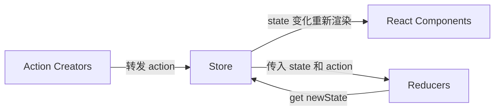

# redux

- createStore

  > 创建store

- combineReducers

- bindActionCreators

- applyMiddleware

- compose

## 为什么要用 `Redux`

`react` 中数据是单向数据流，为了解决两个非父子组件之间的通信

## `Redux` 设计理念

`Redux` 是将整个应用状态存储到一个地方上称为 `store` ,里面保存着一个状态树 `store tree` ,组件可以派发 `dispatch` 行为 `action` 给 `store`,而不是直接通知其他组件，组件内部通过订阅 `store` 中的状态 `state` 来刷新自己的视图。

> `Redux`工作流




## `Redux` 三大原则

1. 唯一数据源

   ​	整个应用的 `state` 都被存储到一个状态树里面，并且这个状态树，只存在于唯一的 `store` 中

2. 保持只读状态

   ​	`state` 是只读的，唯一改变 `state` 的方法就是触发 ·action，`action` 是一个用于描述以发生时间的普通对象

3. 数据改变只能通过纯函数来执行

   ​	使用纯函数来执行修改，为了描述 `action` 如何改变 `state` 的，你需要编写 `reducers

## connect

```js
connect([mapStateToProps], [mapDispatchToProps], [mergeProps],[options])
```


> 作用

​	连接React组件与 Redux store

> 参数说明

这个函数允许我们将 store 中的数据作为 props 绑定到组件上。

```js
const mapStateToProps = (state) => {
  return {
    count: state.count
  }
}
```

- 这个函数的第一个参数就是 Redux 的 store，我们从中摘取了 count 属性。你不必将 state 中的数据原封不动地传入组件，可以根据 state 中的数据，动态地输出组件需要的（最小）属性。
- 函数的第二个参数 ownProps，是组件自己的 props。有的时候，ownProps 也会对其产生影响。当 state 变化，或者 ownProps 变化的时候，mapStateToProps 都会被调用，计算出一个新的 stateProps，（在与 ownProps merge 后）更新给组件。